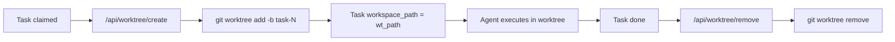

## Why

Hermes agents currently execute all tasks in the same workspace directory, meaning concurrent agents overwrite each other's files. The kanban task model already has `workspace_kind` and `workspace_path` fields but they default to `"scratch"` and `None` — never populated. Git worktree isolation is the foundational capability needed for multi-agent parallel execution, where each agent task gets its own branch and directory without file conflicts.

## What Changes

- Add `/api/worktree/create` — creates an isolated git worktree with a new branch from a base ref; returns `{worktree_id, path, branch}`
- Add `/api/worktree/list` — lists all worktrees for the current workspace session
- Add `/api/worktree/remove` — removes a worktree and cleans up its branch
- Wire kanban task claim to populate `workspace_kind="worktree"` and `workspace_path` when a task transitions to `running`
- Add MCP worktree tools (`worktree_create`, `worktree_list`, `worktree_remove`) so external agents can manage worktrees
- Add worktree status display in kanban task cards (frontend)

## Capabilities

### New Capabilities
- `worktree-api`: REST API endpoints for creating, listing, and removing git worktrees with branch isolation
- `worktree-mcp`: MCP tool surface exposing worktree CRUD operations to external agent clients
- `worktree-kanban-binding`: Integration that binds a worktree path to a kanban task on claim and cleans up on completion

### Modified Capabilities
- (none — this is the first change in the project's openspec history)

## Impact

- **Backend**: `api/workspace.py` (worktree CRUD functions), `api/routes.py` (3 new endpoints), `api/kanban_bridge.py` (claim binding), `mcp_server.py` (3 new MCP tools)
- **Frontend**: `static/panels.js` (worktree status chip in kanban task cards)
- **Dependencies**: Requires `git` CLI available on the server host; uses `subprocess.run` for `git worktree add/remove/list` commands
- **No breaking changes** — existing `workspace_kind` field already exists on kanban task model; this populates it rather than replacing it