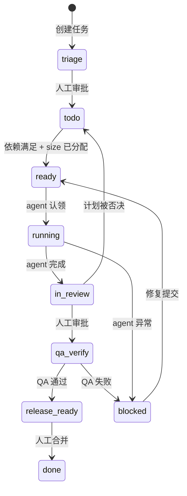

## Why（动机）

当前 Hermes 平台没有 agent 角色概念——所有 agent 都是同质化的执行者。同时 kanban 任务只有 6 个状态列（triage/todo/ready/running/blocked/done），无法支撑多 agent 协作流水线中所需的审查和 QA 验证阶段。引入角色和扩展状态是 M3（角色派发）和 M5（QA 管线）的前提——没有角色词汇，就无法路由任务；没有 in_review/qa_verify 状态，QA 就无法介入。

## What Changes（变更内容）

- 新增 `role` 字段到 Session 模型，取值为 `coder`、`qa`、`planner`、`reviewer`
- 在 profile config.yaml 中新增 `role` 键，默认值 `coder`
- 新增 `task_size` 字段到 kanban 任务模型，取值为 `small`、`medium`、`large`
- **BREAKING** 扩展 `BOARD_COLUMNS` 从 6 列到 9 列：`[triage, todo, ready, running, in_review, qa_verify, blocked, release_ready, done]`
- 新增状态转换验证：`in_review` 仅来自 `running`，`qa_verify` 仅来自 `in_review`，`release_ready` 仅来自 `qa_verify`
- 前端 kanban 看板渲染 9 列布局，新增列带角色/阶段标签
- Session 侧边栏显示角色徽章（coder/qa/planner/reviewer）
- SSE 事件覆盖新增状态转换

## Capabilities（能力清单）

### New Capabilities（新增能力）
- `agent-roles`：Session 角色字段和 profile 角色配置，支持 coder/qa/planner/reviewer
- `kanban-status-extensions`：9 列 kanban 状态模型、task_size 字段、状态转换验证规则
- `kanban-9col-rendering`：前端 9 列看板渲染、角色徽章、新增列标签

### Modified Capabilities（修改能力）
- `worktree-kanban-binding`：任务认领绑定逻辑需兼容新状态转换（running → in_review 时仍保留 worktree 绑定）

## Impact（影响范围）

- **后端修改**：`api/kanban_bridge.py`（BOARD_COLUMNS 扩展、task_size 字段、状态转换验证）、`api/models.py`（Session role 字段）、`api/profiles.py`（role 键）、`mcp_server.py`（角色感知的 kanban 工具）
- **前端修改**：`static/panels.js`（9 列 kanban 渲染、角色徽章）、`static/ui.js`（侧边栏角色显示）
- **Breaking change**：BOARD_COLUMNS 从 6 列扩展到 9 列，依赖 6 列的外部集成需适配。MCP kanban 工具返回的列名会增加 in_review、qa_verify、release_ready
- **依赖 M1**：worktree 绑定逻辑需适配新状态