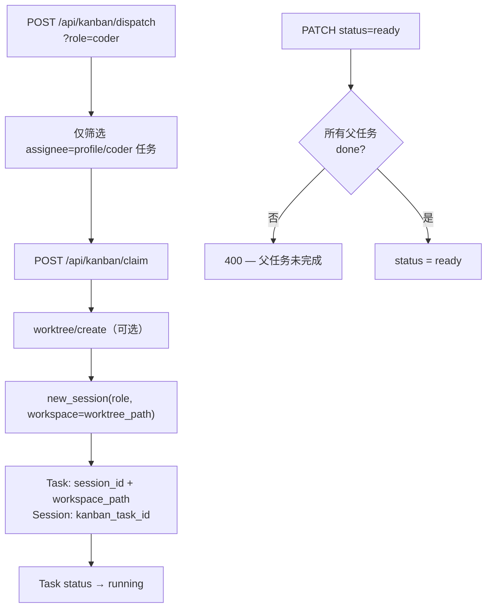

## Why（动机）

M1 提供了 worktree 隔离基础，M2 建立了角色词汇和 9 列任务状态。但 agent 认领任务时，仍无法自动绑定 session + worktree——任务的 `workspace_path` 需手动填写，dispatcher 不区分角色，任务依赖关系（DAG）也不被执行层强制执行。M3 打通任务认领到 agent 执行的完整链路：认领即绑定，派发即路由，DAG 即阻塞。

## What Changes（变更内容）

- 新增 `POST /api/kanban/claim` — 认领任务：自动创建 worktree（可选）、创建 session（继承 role + worktree 作为 workspace）、写入 `kanban_task_id` 反向绑定到 Session，将 `session_id` 和 `workspace_path` 写回任务
- Session 模型新增 `kanban_task_id` 字段（反向绑定，可查"哪个 session 在处理哪个任务"）
- `POST /api/kanban/dispatch` 新增 `role` 参数 — dispatcher 仅认领 `assignee` 匹配当前 profile/role 的任务
- DAG 强制执行：`POST /api/kanban/tasks/<id>/patch` 中 `status=ready` 时检查所有父任务是否 `done`；未完成则返回 400
- 前端看板 Dispatch 按钮新增 role 显示，任务卡片绑定 session 时显示 session 链接 badge

## Capabilities（能力清单）

### New Capabilities（新增能力）
- `task-claim-binding`：任务认领端点，自动完成 worktree + session 创建与双向绑定
- `role-aware-dispatch`：dispatcher 支持 role 过滤参数
- `dag-enforcement`：任务转为 ready 时强制检查父任务完成状态

### Modified Capabilities（修改能力）
- `worktree-kanban-binding`：claim 流程取代手动填写 workspace_path
- `agent-roles`：Session 新增 `kanban_task_id` 反向绑定字段

## Impact（影响范围）

- **新增**：`api/kanban_bridge.py`（`claim_task_with_binding`、DAG 检查、role filter）
- **修改**：`api/models.py`（`kanban_task_id` 字段）、`api/routes.py`（`/api/kanban/claim` 端点、dispatch role param）、`static/panels.js`（claim 按钮、session badge）
- **依赖 M1**：需要 worktree API；依赖 M2：需要 Session.role 和 BOARD_COLUMNS 9 列
- **无 breaking change** — 现有 dispatch 端点新增可选 `role` 参数；旧调用方不传 role 则行为不变