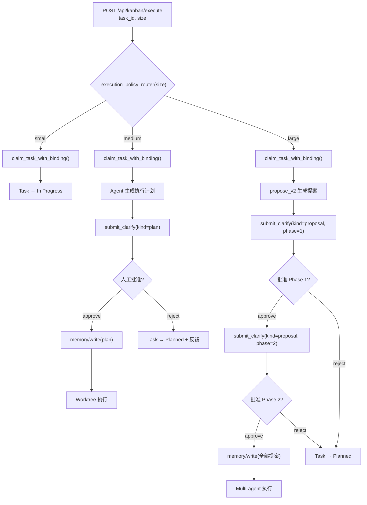

## Why（动机）

M3 建立了任务认领与 session/worktree 绑定的基础，但所有任务被一视同仁地认领执行——无论是一行 hotfix 还是需要设计文档的复杂需求。M4 在认领路径上插入"执行策略路由器"：根据 `task_size`（small/medium/large）自动选择执行路径，并在 medium/large 任务中通过 clarify 流程引入人工审批门控。这确保 agent 在大任务上不会绕过规划环节直接执行，同时小任务零摩擦。

## What Changes（变更内容）

- 新增 `POST /api/kanban/execute` — 执行策略路由入口：根据 task_size 路由到对应执行路径，返回路由决策和执行状态
- **Small**：直接调用 `claim_task_with_binding`（M3 已有），无额外门控
- **Medium**：认领任务 → agent 生成执行计划 → 通过 clarify 卡片推送给人工审批 → 批准后将计划写入 memory → worktree 执行
- **Large**：认领任务 → planner 调用 `propose_v2` 生成 OpenSpec 提案 → 多阶段 clarify 审批（设计→提案→任务拆解，每阶段独立审批）→ 全部通过后写入 memory → 多 agent worktree 执行
- 扩展 `clarify.py`：`submit_pending` 支持 `kind` 字段（`"text"` | `"plan"` | `"proposal"`），使 UI 能渲染不同格式的内容卡片
- Clarify-to-memory 桥接：clarify 批准后自动调用 `/api/memory/write` 保存计划/提案
- 前端 `static/messages.js`：新增 clarify plan/proposal 卡片渲染（Markdown 格式化）

## Capabilities（能力清单）

### New Capabilities（新增能力）
- `execution-policy-router`：根据 task_size 自动路由到 small/medium/large 执行路径的 REST 端点
- `structured-clarify`：clarify 支持 `kind` 字段，区分普通问题、执行计划、OpenSpec 提案，UI 对应不同渲染
- `clarify-to-memory`：clarify 批准后自动持久化到 memory，供 agent 后续执行参考

### Modified Capabilities（修改能力）
- `task-claim-binding`（M3）：`/api/kanban/execute` 内部复用 `claim_task_with_binding`，执行路径包装在策略路由之上

## Impact（影响范围）

- **新增**：`api/kanban_bridge.py`（`_execution_policy_router` 函数、`_execute_payload`）、`api/routes.py`（`/api/kanban/execute` 端点）
- **修改**：`api/clarify.py`（`submit_pending` 支持 `kind` 字段）、`static/messages.js`（plan/proposal clarify 卡片渲染）
- **依赖 M3**：复用 `claim_task_with_binding`；依赖 M2：`task_size` 字段已存在
- **无 breaking change**：clarify `kind` 字段为增量字段，旧调用方不传 kind 则默认 `"text"` 行为不变