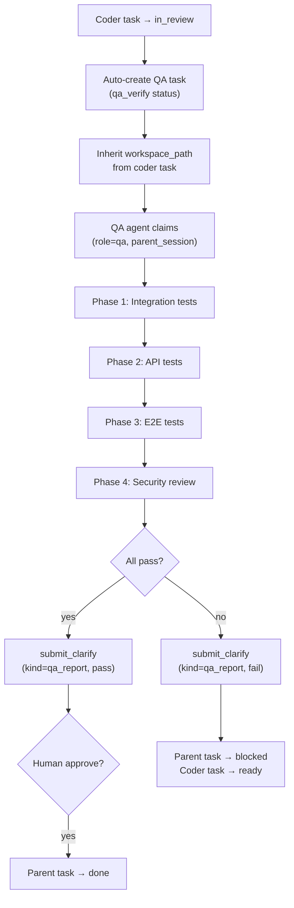

## Why（动机）

M4 建立了执行策略路由和 clarify 审批门控，但 agent 完成实现后没有自动验证环节——任务直接从 `running` 标为 `done`，跳过了 QA 检查。M5 在 coder 完成（`in_review`）时自动创建 QA 子任务，由独立的 QA agent 执行 4 阶段测试管线，验证结果通过 clarify 提交给人工。通过后任务进入 `done`；失败则任务阻塞并创建修复反馈。

## What Changes（变更内容）

- 当 coder 任务转为 `in_review` 时，自动创建 QA 子任务（`qa_verify` 状态），设置父子依赖链接
- QA 子任务继承 coder 任务的 `workspace_path`（同一 worktree）
- QA 子任务被 QA profile agent 认领时，创建 session（`role=qa`，`parent_session_id=coder_session_id`）
- QA 管线按序执行 4 个阶段：集成测试 → API 测试 → E2E 测试 → 安全审查
- 每阶段结果记录在 QA 任务的 `result` 字段中
- 全部通过 → 提交 clarify 报告给人工 → 父任务 `done`
- 任一失败 → 提交 clarify 失败报告 → 父任务 `blocked`，coder 子任务 `ready` 重新分配
- 前端 kanban 卡片显示 QA 阶段进度指示器

## Capabilities（能力清单）

### New Capabilities（新增能力）
- `qa-auto-spawn`：coder 任务进入 `in_review` 时自动创建 QA 子任务，继承 worktree，设置依赖
- `qa-pipeline`：QA 任务的 4 阶段验证管线状态机（IT → API → E2E → Security），结果通过 clarify 上报
- `qa-progress-indicator`：前端 kanban 卡片上的 QA 阶段进度显示（Phase 1/4、2/4...）

### Modified Capabilities（修改能力）
- `kanban-status-extensions`（M2）：`in_review` 状态转换触发 QA spawn 副作用
- `structured-clarify`（M4）：新增 `kind="qa_report"` 用于 QA 结果展示
- `task-claim-binding`（M3）：QA claim 时继承 `parent_session_id`

## Impact（影响范围）

- **修改**：`api/kanban_bridge.py`（`_patch_task` 中 `in_review` 分支新增 QA spawn）、`api/routes.py`（QA 结果处理）
- **新增**：QA pipeline 状态跟踪逻辑（可作为 `api/qa_pipeline.py` 或集成到 `kanban_bridge.py`）
- **前端修改**：`static/panels.js`（QA 进度指示器在任务卡片中）、`static/messages.js`（`kind="qa_report"` clarify 卡片）
- **依赖 M3**：`claim_task_with_binding`（QA claim 带 `parent_session_id`）
- **依赖 M4**：`structured-clarify`（`kind="qa_report"`）
- **无 breaking change**：QA spawn 仅在 `in_review` 触发，旧任务不受影响