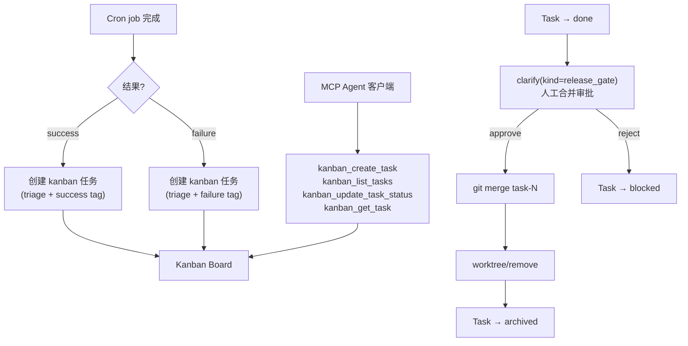

## Why（动机）

M1-M5 建立了完整的任务执行链路（worktree → 角色 → 认领 → 策略路由 → QA 验证），但缺少三个"收尾"能力：① Cron 定时任务无法自动创建 kanban 任务（目前只能手动）；② 外部 agent 客户端无法通过 MCP 操作 kanban 看板；③ QA 通过后的任务（`done` 状态）没有人工合并审批门控——agent 的代码修改无法安全落地到主分支。M6 补齐这三个缺口，完成平台闭环。

## What Changes（变更内容）

- **Cron-to-Kanban 桥接**：cron job config 新增 `on_success_create_task` 和 `on_failure_create_task` 字段；cron 执行完成后自动在 kanban 中创建 `triage` 状态任务，关联 `cron_run_id`
- **MCP Kanban 工具**：在 `mcp_server.py` 中新增 4 个 MCP 工具：`kanban_create_task`、`kanban_list_tasks`、`kanban_update_task_status`、`kanban_get_task`，供外部 agent 客户端（Claude Code、其他 MCP 客户端）操作看板
- **Release Gate**：`done` 状态的任务需经人工合并审批（通过 clarify，`kind="release_gate"`）→ 批准后执行 `git merge task-N` + `worktree_remove` → 任务最终归档
- Agent 专属 memory namespace：`{profile_home}/memory/{role}/` 路径
- Agent 专属 skills：session 创建时根据 role 注入对应 skills

## Capabilities（能力清单）

### New Capabilities（新增能力）
- `cron-to-kanban`：cron 执行结果自动创建 kanban 任务
- `mcp-kanban-tools`：MCP 工具面暴露 kanban CRUD 操作
- `release-gate`：done 状态任务的人工合并审批 + git merge + worktree cleanup

### Modified Capabilities（修改能力）
- `worktree-kanban-binding`（M1）：release gate 合并后调用 `worktree_remove` 清理
- `structured-clarify`（M4）：新增 `kind="release_gate"` clarify 卡片

## Impact（影响范围）

- **修改**：`api/routes.py`（cron 完成回调中新增任务创建逻辑）、`mcp_server.py`（4 个新 MCP 工具）、`api/kanban_bridge.py`（release gate 逻辑）、`static/messages.js`（release gate clarify 卡片）
- **依赖 M1**：worktree API（merge + remove）
- **依赖 M4**：structured clarify（`kind="release_gate"`）
- **无 breaking change**：cron config 新增可选字段；MCP 新增工具不影响现有工具