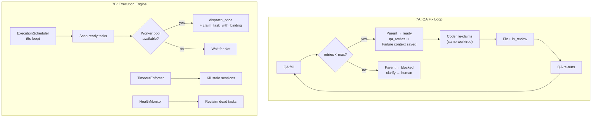

## Why（动机）

M1-M6 建立了完整的任务管线（worktree → 角色 → 认领 → 策略路由 → QA → 合并），但存在三个缺口阻碍真正的自主执行：

1. **QA 失败后无自动修复循环**：QA 失败 → 任务 blocked → 需要人工干预。没有 Coder agent 自动重试修复的机制。
2. **缺少执行引擎**：执行依赖隐式的 session + subprocess，无持久调度器、worker pool、超时执行或故障恢复。
3. **Playwright SSE mock 缺陷**：M4 的 3 个 clarify 卡片 E2E 测试因无法正确 mock SSE 事件流而失败。

M7 补齐这三个缺口，使平台具备真正的自主 agent 循环执行能力。

## What Changes（变更内容）

### 7A: QA ↔ Coder 自动修复循环
- QA 失败时：若 `qa_retries < max_retries`（默认 3），自动将父任务设为 `ready`（而非 `blocked`），并递增 `qa_retries` 计数
- Coder agent 重新认领同一任务（dispatcher 路由），复用原 worktree（不创建新 worktree）
- 前次失败上下文通过 session memory 或 task comment 传递给 coder
- 达到 max_retries 后升级为 `blocked` + 提交 clarify 给人工（"QA 失败 N 次——需人工介入"）
- 前端任务卡片显示重试计数 badge

### 7B: Agent 执行引擎（Hermes Agent 统一运行时）
- **所有 worker 都是 Hermes Agent subprocess**（不引入 Claude Code SDK）——planning 和 execution 使用同一运行时，通过 profile SOUL.md + skill 注入区分行为
- 持久调度循环（`ExecutionScheduler`）：周期性（每 5s）扫描 `ready` 任务并 dispatch
- Worker pool：配置 `max_concurrent`（默认 4）并发 hermes-agent subprocess 上限
- 超时执行器：检查 `max_runtime_seconds`，超时任务 kill subprocess + 设为 `blocked`
- 健康监控：心跳检查（`last_heartbeat_at`），stale task 自动 reclaim
- `/api/execution/status` 端点：返回活跃 worker 数、队列深度、吞吐量
- `config.yaml` 新增 `execution:` 配置段
- **2 个人工确认门控**：① Plan approval（medium/large 任务，plan 生成后暂停等待人工确认）② Release gate（QA 全通过后 merge 审批）。两个 gate 之间的执行完全自主（code→test→QA loop，无中途确认）

### 7C: Playwright SSE Clarify Mock 修复
- 重构 M4 Playwright 测试：使用 `page.evaluate(() => showClarifyCard({...}))` 直接注入 clarify 卡片，绕过 SSE
- 修复 3 个失败的 US-2/3/4 测试

## Capabilities（能力清单）

### New Capabilities（新增能力）
- `qa-fix-loop`：QA 失败后的自动重试循环，含 retry 计数和人工升级
- `execution-scheduler`：持久调度循环 + worker pool + 超时/健康监控
- `execution-status-api`：`/api/execution/status` 监控端点

### Modified Capabilities（修改能力）
- `qa-pipeline`（M5）：QA 失败路径新增 retry 逻辑
- `task-claim-binding`（M3）：重试 claim 复用原 worktree
- `structured-clarify`（M4）：Playwright SSE mock 修复

## Impact（影响范围）

- **新增**：`api/execution.py`（调度器 + worker pool + 监控）、`api/routes.py`（`/api/execution/status`）
- **修改**：`api/kanban_bridge.py`（QA 失败重试逻辑、retry 计数）、`mcp_server.py`（execution status MCP 工具可选）
- **前端修改**：`static/panels.js`（retry 计数 badge）、`e2e/m4-execution-policy-router.spec.ts`（SSE mock 修复）
- **配置**：`config.yaml` 新增 `execution:` 段（`max_concurrent`、`scheduler_interval`、`max_qa_retries`）
- **无 breaking change**